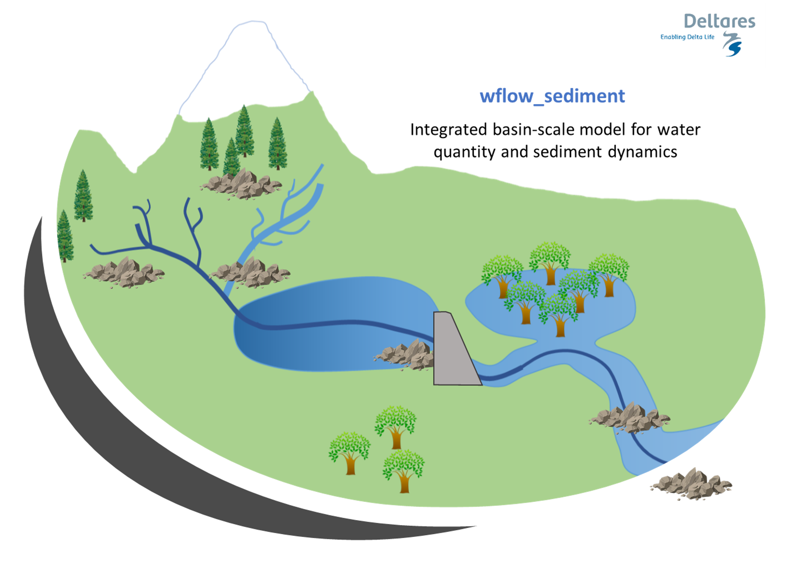

# wflow\_sediment

The processes and fate of many particles and pollutants impacting water quality at the
catchment level are intricately linked to the processes governing sediment dynamics. Both
nutrients such as phosphorus, carbon or other pollutants such as metals are influenced by
sediment properties in processes such as mobilization, flocculation or deposition. To better
assert and model water quality in inland systems, a better comprehension and modelling of
sediment sources and fate in the river is needed at a spatial and time scale relevant to
such issues. 

The wflow_sediment model was developed to answer such issues. It is a distributed
physics-based model, based on the distributed hydrologic wflow_sbm model. It is able to
simulate both land and in-stream processes, and relies on available global datasets,
parameter estimation and small calibration effort.

In order to model the exports of terrestrial sediment to the coast through the Land Ocean
Aquatic Continuum or LOAC (inland waters network such as streams, lakes...), two different
modelling parts were considered. The first part, called the inland sediment model, is the
modelling and estimation of soil loss and sediment yield to the river system by land
erosion, separated into vertical [Soil Erosion](@ref) processes and lateral [Sediment Flux
in overland flow](@ref). The second part, called the [River Sediment Model](@ref) is the
transport and processes of the sediment in the river system. The two parts together
constitute the wflow\_sediment model.

Overview of the concepts of the wflow\_sediment model:


## Configuration

As sediment generation and transport processes are linked to the hydrology and water flows,
the inputs to the wflow\_sediment model come directly from a hydrological model. The
required dynamic inputs to run wflow\_sediment are:

-  Precipitation (can also come from the hydrological forcing data),
-  Land runoff (overland flow) from the kinematic wave,
-  River runoff from the kinematic wave,
-  Land water level in the kinematic wave,
-  River water level in the kinematic wave,
-  Rainfall interception by the vegetation.

These inputs can be obtained from other wflow models such as wflow\_sbm, wflow\_hbv or from
other sources.

Model outputs can be saved for both the inland and the instream part of the model. Some
examples are listed below.

```toml
[output.vertical]
# Soil splash erosion [ton]
sedspl = "sedspl"
# Soil erosion by overland flow [ton]
sedov = "sedov"
# Total soil loss [ton]
soilloss = "soilloss"
# Total transport capacity of overland flow [ton]
TCsed = "TCsed"
# Transport capacity per particle class (clay) [ton]
TCclay = "TCclay"

[output.lateral.land]
# Total (or per particle class) sediment flux in overland flow [ton]
olsed = "olsed"
olclay = "olclay"
# Total (or per particle class) sediment yield to the river [ton]
inlandsed = "inlandsed"
inlandclay = "inlandclay"

[output.lateral.river]
# Total sediment concentration in the river (suspended + bed load) [kg/m3]
Sedconc = "Sedconc"
# Suspended load [kg/m3]
SSconc = "SSconc"
# Bed load [kg/m3]
Bedconc = "Bedconc"
```