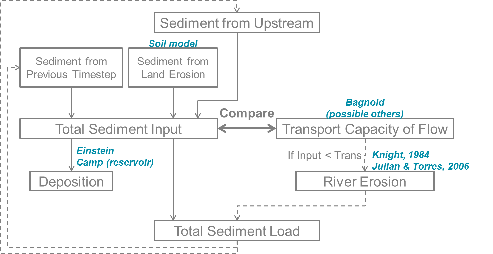

# Sediment flux

Both the inland and river sediment model take into account sediment flux or transport of
sediment in water, either in overland flow or in the stream flow. These two transport are
distinguished in two different structures.

## Inland Sediment Model

### Sediment Flux in overland flow
Once the amount of soil detached by both rainfall and overland flow has been estimated, it
has then to be routed and delivered to the river network. Inland routing in sediment models
is usually done by comparing the amount of detached sediment with the transport capacity of
the flow, which is the maximum amount of sediment than the flow can carry downslope. There
are several existing formulas available in the literature. For a wide range of slope and for
overland flow, the Govers equation (1990) seems the most appropriate choice (Hessel et al,
2007). However, as the wflow\_sediment model was developed to be linked to water quality
issues, the Yalin transport equation was chosen as it can handle particle differentiation
(Govers equation can still be used if wflow\_sediment is used to only model inland processes
with no particle differentiation). For land cells, wflow\_sediment assumes that erosion can
mobilize 5 classes of sediment:

- Clay (mean diameter of 2 ``\mu``m)
- Silt (mean diameter of 10 ``\mu``m)
- Sand (mean diameter of 200 ``\mu``m)
- Small aggregates (mean diameter of 30 ``\mu``m)
- Large aggregates (mean diameter of 500 ``\mu``m).

```math
   PSA = SAN (1-CLA)^{2.4} \\
   PSI = 0.13SIL\\
   PCL = 0.20CLA \\
   SAG = 2.0CLA \, ; \, CLA < 0.25 \\
   SAG = 0.28(CLA-0.25)+0.5 \, ; \, 0.25 \leq CLA \leq 0.5 \\
   SAG = 0.57 \, ; \, CLA > 0.5 \\
   LAG = 1 - PSA - PSI - PCL - SAG
```

where ``CLA``, ``SIL`` and ``SAN`` are the primary clay, silt, sand fractions of the topsoil
and ``PCL``, ``PSI``, ``PSA``, ``SAG`` and ``LAG`` are the clay, silt, sand, small and large
aggregates fractions of the detached sediment respectively. The transport capacity of the
flow using Yalin’s equation with particle differentiation, developed by Foster (1982), is:
```math 
   TC_{i} = (P_{e})_{i}  (S_{g})_{i} \, \rho_{w} \,  g \, d_{i}  V_{*}
```
where ``TC_{i}`` is the transport capacity of the flow for the particle class i,
``(P_{e})_{i}`` is the effective number of particles of class i, ``(S_{g})_{i}`` is the
specific gravity for the particle class i (kg m``^{-3}``), ``\rho_{w}`` is the mass density
of the fluid (kg m``^{-3}``), ``g`` is the acceleration due to gravity (m s``^{-2}``),
``d_{i}`` is the diameter of the particle of class i (m) and ``V_{*}=(g R S)^{0.5}`` is the
shear velocity of the flow (m s``^{-1}``) with ``S`` the slope gradient and ``R`` the
hydraulic radius of the flow (m). The detached sediment are then routed downslope until the
river network using the accucapacityflux, accupacitystate functions depending on the
transport capacity from Yalin.

The choice of transport capacity method for the overland flow is set up in the model section
of the TOML:
```toml
[model]
landtransportmethod = "yalinpart" # Overland flow transport capacity method: ["yalinpart", "govers", "yalin"]
```
Note that the "govers" and "yalin" equations can only assess total transport capacity of the
flow and can therefore not be used in combination with the river part of the sediment model.

## River Sediment Model

Sediment dynamics in the river can be described by the three same processes than on the
land: erosion, deposition and transport. The difference is that channel flow is much higher,
deeper and permanent compared to overland flow. In channels, erosion is the direct removal of
sediments from the river bed or bank (lateral erosion). Sediments are transported in the
river either by rolling, sliding and silting (bed load transport) or via turbulent flow in
the higher water column (suspended load transport). The type of transport is determined by
the river bed shear stress. As sediment particles have a higher density than water, they can
also be deposited on the river bed according to their settling velocity compared to flow
velocity. In addition to regular deposition in the river, lakes, reservoirs and floodplains
represents additional major sediment settling pools.

Complete models of sediment dynamics based on hydrology and not hydraulic or hydrodynamic
are much rarer than for soil loss and inland dynamics. The simpler models such as the SWAT
default sediment river model uses again the transport capacity of the flow to determine if
there is erosion or deposition (Neitsch et al., 2011).  A more physics-based approach
(Partheniades, 1965) to determine river erosion is used by Liu et al. (2018) and in the new
SWAT’s approach developed by Narasimhan et al. (2017). For wflow_sediment, the new
physics-based model of SWAT was chosen for transport and erosion as it enables the use of
parameter estimation for erosion of bed and bank of the channel and separates the suspended
from the bed loads. 

Overview of the different processes for a river cell in wflow\_sediment.



Running the river model is an option of the wflow\_sediment model and is enabled using the
TOML file. By default it is `false`:
```toml
[model]
runrivermodel = true
```

### Sediment inputs in a river cell
The first part of the river model assesses how much detached sediment are in the river cell
at the beginning of the timestep ``t``. Sources of detached sediment are sediments coming
from land erosion, estimated with the soil loss part of wflow_sediment model, the sediment
coming from upstream river cells and the detached sediment that were left in the cell at the
end of the previous timestep ``(t-1)``:
```math 
   (sed_{in})_{t} = (sed_{land})_{t} + upstream\left[(sed_{out})_{t-1}\right] + (sed_{riv})_{t-1}
```

### River transport and erosion
Once the amount of sediment inputs at the beginning of the timestep is known, the model then
estimates transport, and river erosion if there is a deficit of sediments. Transport in the
river system is estimated via a transport capacity formula. There are several transport
capacity formulas available in wflow_sediment, some requiring calibration and some not.
Choosing a transport capacity equation depends on the river characteristics (some equation
are more suited for narrow or wider rivers), and on the reliability of the required river
parameters (such as slope, width or mean particle diameter of the river channel). Several
river transport capacity are available and the choice is set up in the model section of the
TOML:
```toml
[model]
rivtransportmethod = "bagnold" # River flow transport capacity method: ["bagnold", "engelund", "yang", "kodatie", "molinas"]
```

**Simplified Bagnold**

Originally more valid for intermediate to large rivers, this simplified version of the
Bagnold equation relates sediment transport to flow velocity with two simple calibration
parameters (Neitsch et al, 2011):
```math 
C_{max} = c_{sp}  \left( \dfrac{prf Q}{h  W} \right) ^{sp_{exp}}
```
where ``C_{max}`` is the sediment concentration (ton m``^{-3}`` or kg/L), ``Q`` is the
surface runoff in the river cell (m``^{3}``s``^{-1}``), ``h`` is the river water level (m),
``W`` is the river width (m) and ``c_{sp}``, ``prf`` and ``sp_{exp}`` are calibration
parameters. The ``prf`` coefficient is usually used to deduce the peak velocity of the flow,
but for simplification in wflow\_sediment, the equation was simplified to only get two
parameters to calibrate: ``sp_{exp}`` and ``c_{Bagnold} = c_{sp} \, prf^{sp_{exp}}``. The
coefficient ``sp_{exp}`` usually varies between 1 and 2 while ``prf`` and ``c_{sp}`` have a
wider range of variation. The table below summarizes ranges and values of the three Bagnold
coefficients used by other studies:

Table: Range of the simplified Bagnold coefficients (and calibrated value)

| Study | River | ``prf`` range | ``c_{sp}`` range | ``sp_{exp}`` range |
|:----- | ----- | ------------- | ---------------- | ------------------ |
| Vigiak 2015 | Danube | 0.5-2 (/) | 0.0001-0.01 (0.003-0.006) | 1-2 (1.4) |
| Vigiak 2017 | Danube | / | 0.0001-0.01 (0.0015) | 1-2 (1.4) |
| Abbaspour 2007 | Thur (CH) | 0.2-0.25 (/) | 0.001-0.002 (/) | 0.35-1.47 (/) |
| Oeurng 2011 | Save (FR) | 0-2 (0.58) | 0.0001-0.01 (0.01) | 1-2 (2) |

**Engelund and Hansen** This transport capacity is not present in SWAT but used in many
models such as Delft3D-WAQ, Engelund and Hansen calculates the total sediment load as
(Engelund and Hansen, 1967):
```math 
   C_{w} = 0.05 \left( \dfrac{\rho_{s}}{\rho_{s} - \rho} \right) \left( \dfrac{u S}{\sqrt{\left( \dfrac{\rho_{s}}{\rho_{s} - \rho} \right) g  D_{50}}} \right) \theta^{1/2}
```
where ``C_{w}`` is the sediment concentration by weight, ``\rho`` and ``\rho_{s}`` are the
fluid and sediment density (here equal to 1000 and 2650 g m``^{-3}``), ``u`` is the water
mean velocity (m s``^{-1}``), ``S`` is the river slope, ``g`` is the acceleration due to gravity,
``D_{50}`` is the river mean diameter (m) and ``\theta`` is the Shields parameter.

**Kodatie** Kodatie (1999) developed the power relationships from Posada (1995) using field
data and linear optimization so that they would be applicable for a wider range of riverbed
sediment size. The resulting equation, for a rectangular channel, is (Neitsch et al, 2011):
```math 
   C_{max} = \left( \dfrac{a u^{b} h^{c} S^{d}}{V_{in}} \right)  W
```
where ``V_{in}`` in the volume of water entering the river cell  
during the timestep (m``^{3}``) and ``a``, ``b``, ``c`` and ``d`` are coefficients depending
on the riverbed sediment size. Values of these coefficients are summarized in the table
below.

Table: Range of the simplified Bagnold coefficients (and calibrated value)

| River sediment diameter | a | b | c | d |
|:------------------------|---|---|---|---|
| ``D_{50} \leq`` 0.05mm | 281.4 | 2.622 | 0.182 | 0 |
| 0.05 ``< D_{50} \leq`` 0.25mm | 2  829.6 | 3.646 | 0.406 | 0.412 |
| 0.25 ``< D_{50} \leq`` 2mm | 2  123.4 | 3.300 | 0.468 | 0.613 |
| ``D_{50} >`` 2mm | 431  884.8 | 1.000 | 1.000 | 2.000 |

**Yang** Yang (1996) developed a set of two equations giving transport of sediments for
sand-bed or gravel-bed rivers. The sand equation (``D_{50} < 2mm``) is:
```math 
   log\left(C_{ppm}\right) = 5.435 - 0.286log\frac{\omega_{s,50}D_{50}}{\nu}-0.457log\frac{u_{*}}{\omega_{s,50}} \\
   +\left(1.799-0.409log\frac{\omega_{s,50}D_{50}}{\nu}-0.314log\frac{u_{*}}{\omega_{s,50}}\right)log\left(\frac{uS}{\omega_{s,50}}-\frac{u_{cr}S}{\omega_{s,50}}\right)
```
And the gravel equation (``2 \leq D_{50} < 10 mm``) is:
```math 
   log\left(C_{ppm}\right) = 6.681 - 0.633log\frac{\omega_{s,50}D_{50}}{\nu}-4.816log\frac{u_{*}}{\omega_{s,50}} \\
   +\left(2.784-0.305log\frac{\omega_{s,50}D_{50}}{\nu}-0.282log\frac{u_{*}}{\omega_{s,50}}\right)log\left(\frac{uS}{\omega_{s,50}}-\frac{u_{cr}S}{\omega_{s,50}}\right)
```
where ``C_{ppm}`` is sediment concentration in parts per million by weight,
``\omega_{s,50}`` is the settling velocity of a particle with the median riverbed diameter
estimated with Stokes (m s``^{-1}``), ``\nu`` is the kinematic viscosity of the fluid
(m``^{2}``s``^{-1}``), ``u_{*}`` is the shear velocity (``\sqrt{gR_{H}S}`` in m s``^{-1}``
with ``R_{H}`` the hydraulic radius of the river) and ``u_{cr}`` is the critical velocity
(m/s, equation can be found in Hessel, 2007).

**Molinas and Wu** The Molinas and Wu (2001) transport equation was developed for large
sand-bed rivers based on the universal stream power ``\psi``. The corresponding equation is
(Neitsch et al, 2011):
```math 
   C_{w} = \dfrac{1430 (0.86+\sqrt{\psi}) \psi^{1.5}}{0.016+\psi} 10^{-6}
```
where ``\psi`` is the universal stream power given by:
```math 
   \psi = \dfrac{\psi^{3}}{\left(\dfrac{\rho_{s}}{\rho}-1\right) g h \omega_{s,50}  \left[ log_{10}\left(\dfrac{h}{D_{50}}\right)\right]^{2}}
```

Once the maximum concentration ``C_{max}`` is established with one of the above transport
formula, the model then determines if there is erosion of the river bed and bank. In order
to do that, the difference ``sed_{ex}`` between the maximum amount of sediment estimated
with transport (``sed_{max} = C_{max} V_{in}``) and the sediment inputs to the river cell
(``sed_{in}`` calculated above) is calculated. If too much sediment is coming in and
``sed_{ex}`` is negative, then there is no river bed and bank erosion. And if the river has
not reach its maximum transport capacity, then erosion of the river happens.

First, the sediments stored in the cell from deposition in previous timesteps ``sed_{stor}``
are eroded from clay to gravel. If this amount is not enough to cover ``sed_{ex}``, then
erosion of the local river bed and bank material starts.

Instead of just setting river erosion amount to just cover the remaining difference
``sed_{exeff}`` between ``sed_{ex}`` and ``sed_{stor}``, actual erosion potential is
adjusted using river characteristics and is separated between the bed and bank of the river
using the physics-based approach of Knight (1984).

The bed and bank of the river are supposed to only be able to erode a maximum amount of
their material ``E_{R,bed}`` for the bed and ``E_{R,bank}`` for the river bank. For a
rectangular channel, assuming it is meandering and thus only one bank is prone to erosion,
they are calculated from the equations (Neitsch et al, 2011):
```math 
   E_{R,bed} = k_{d,bed} \left( \tau_{e,bed} - \tau_{cr,bed} \right) 10^{-6}  L  W  \rho_{b, bed}  \Delta t \\~\\
   E_{R,bank} = k_{d,bank} \left( \tau_{e,bank} - \tau_{cr,bank} \right) 10^{-6} L h \rho_{b, bank}  \Delta t
```
where ``E_{R}`` is the potential bed/bank erosion rates (tons), ``k_{d}`` is the erodibility
of the bed/bank material (cm``^{3}`` N``^{-1}`` s``^{-1}``), ``\tau_{e}`` is the effective
shear stress from the flow on the bed/bank (N m``^{-2}``), ``\tau_{cr}`` is the critical
shear stress for erosion to happen (N m``^{-2}``), ``L``, ``W`` and ``h`` are the channel
length, width and water height (m), ``\rho_{b}`` is the bulk density of the bed/bank of the
river (g cm``^{-3}``) and ``\Delta t`` is the model timestep (s).

In wflow_sediment, the erodibility of the bed/bank are approximated using the formula from
Hanson and Simon (2001):
```math 
   k_{d}=0.2 \tau_{cr}^{-0.5}
```
Normally erodibilities are evaluated using jet test in the field and there are several
reviews and some adjustments possible to this equation (Simon et al, 2011). However, to
avoid too heavy calibration and for the scale considered, this equation is supposed to be
efficient enough. The critical shear stress ``\tau_{cr}`` is evaluated differently for the
bed and bank. For the bed, the most common formula from Shields initiation of movement is
used. For the bank, a more recent approach from Julian and Torres (2006) is used :
```math 
   \tau_{cr,bank} = (0.1+0.1779 SC+0.0028 SC^{2}-2.34 10^{-5}  SC^{3}) C_{ch}
```
where ``SC`` is the percent clay and silt content of the river bank and ``C_{ch}`` is a
coefficient taking into account the positive impact of vegetation on erosion reduction. This
coefficient is then dependent on the land use and classical values are shown in the table
below. These values where then adapted for use with the GlobCover land use map. Percent of
clay and silt (along with sand and gravel) for the channel is estimated from the river
median particle diameter assuming the same values as SWAT shown in the table below. Median
particle diameter is here estimated depending on the Strahler river order. The higher the
order, the smaller the diameter is. As the median diameter is only used in wflow_sediment
for the estimation of the river bed/bank sediment composition, this supposition should be
enough. Actual refined data or calibration may however be needed if the median diameter is
also required for the transport formula. In a similar way, the bulk densities of river bed
and bank are also just assumed to be of respectively 1.5 and 1.4 g cm``^{-3}``.

Table: Classical values of the channel cover vegetation coefficient (Julian and Torres, 2006)

| Bank vegetation | ``C_{ch}`` |
|:--------------- | ---------- |
| None | 1.00 |
| Grassy | 1.97 |
| Sparse trees | 5.40 |
| Dense trees | 19.20 |

Table : Composition of the river bed/bank depending on the median diameter ``d_{50}``
\[``\mu``m\] (Neitsch et al, 2011) 

|Sediment Fraction   | ``\leq`` 5 | 5 to 50 | 50 to 2000 | ``>``2000 |
|:-------------------| ---------- | ------- | ---------- | --------- |
| Sand | 0.15 | 0.15 | 0.65 | 0.15 |
| Silt | 0.15 | 0.65 | 0.15 | 0.15 |
| Clay | 0.65 | 0.15 | 0.15 | 0.05 |
| Gravel | 0.05 | 0.05 | 0.05 | 0.65 |

Then, the repartition of the flow shear stress is refined into the effective shear stress
and the bed and bank of the river using the equations developed by Knight (1984) for a
rectangular channel:
```math 
   \tau_{e,bed} = \rho g R_{H} S  \left(1 - \dfrac{SF_{bank}}{100}\right) \left(1+\dfrac{2h}{W}\right) \\~\\
   \tau_{e,bank} = \rho g R_{H} S  \left( SF_{bank}\right)  \left(1+\dfrac{W}{2h}\right)
```
where ``\rho g`` is the fluid specific weight (9800 N m``^{-3}`` for water), ``R_{H}`` is the
hydraulic radius of the channel (m), ``h`` and ``W`` are the water level and river width
(m). ``SF_{bank}`` is the proportion of shear stress acting on the bank (%) and is estimated
from (Knight, 1984):
```math 
   SF_{bank} = exp \left( -3.230 log_{10}\left(\dfrac{W}{h}+3\right)+6.146 \right)
```
Finally the relative erosion potential of the bank and bed of the river is calculated by:
```math 
   RTE_{bed} = \dfrac{E_{R,bed}}{E_{R,bed}+E_{R,bank}} \\~\\
   RTE_{bank} = 1 - RTE_{bed}
```
And the final actual eroded amount for the bed and bank is the maximum between ``RTE
sed_{exeff}`` and the erosion potential ``E_{R}``. Total eroded amount of sediment
``sed_{erod}`` is then the sum of the eroded sediment coming from the storage of previously
deposited sediment and the river bed/bank erosion.

### River deposition
As sediments have a higher density than water, moving sediments in water can be deposited in
the river bed. The deposition process depends on the mass of the sediment, but also on flow
characteristics such as velocity. In wflow_sediment, as in SWAT, deposition is modelled with
Einstein’s equation (Neitsch et al, 2011):
```math 
   P_{dep}=\left(1-\dfrac{1}{e^{x}}\right)100
```
where ``P_{dep}`` is the percentage of sediments that is deposited on the river bed and x is
a parameter calculated with:
```math 
   x = \dfrac{1.055 L  \omega_{s}}{u h}
```
where ``L`` and ``h`` are channel length and water height (m), ``\omega_{s}`` is the
particle settling velocity calculated with Stokes formula (m s``^{-1}``) and ``u`` is the
mean flow velocity (m s``^{-1}``). The calculated percentage is then subtracted from the
amount of sediment input and eroded river sediment for each particle size class (``sed_{dep}
= P_{dep}/100 (sed_{in} + sed_{erod})``). Resulting deposited sediment are then stored in
the river bed and can be re-mobilized in future time steps by erosion.

### Mass balance and sediment concentration
Finally after estimating inputs, deposition and erosion with the transport capacity of the
flow, the amount of sediment actually leaving the river cell to go downstream is estimated
using:
```math 
   sed_{out} = (sed_{in} + sed_{erod} - sed_{dep}) \dfrac{V_{out}}{V}
```
where ``sed_{out}`` is the amount of sediment leaving the river cell (tons), ``sed_{in}`` is
the amount of sediment coming into the river cell (storage from previous timestep, land
erosion and sediment flux from upstream river cells in tons), ``sed_{erod}`` is the amount
of sediment coming from river erosion (tons), ``sed_{dep}`` is the amount of deposited
sediments (tons), ``V_{out}`` is the volume of water leaving the river cell (surface runoff
``Q`` times timestep ``\Delta t`` in m``^{3}``) and ``V`` is the total volume of water in
the river cell (``V_{out}`` plus storage ``h W L`` in m``^{3}``).

A mass balance is then used to calculate the amount of sediment remaining in the cell at the
end of the timestep ``(sed_{riv})_{t}``:
```math 
   (sed_{riv})_{t} = (sed_{riv})_{t-1} + (sed_{land})_{t} + upstream\left[(sed_{out})_{t-1}\right] + (sed_{erod})_{t} - (sed_{dep})_{t} - (sed_{out})_{t}
```

### Lake and reservoir modelling
Apart from land and river, the hydrologic wflow\_sbm model also handles lakes and reservoirs
modelling. In wflow\_sbm, lakes and large reservoirs are modelled using a 1D bucket model at
the cell corresponding to the outlet. For the other cells belonging to the lake/reservoir
which are not the outlet, processes such as precipitation and evaporation are filtered out
and shifted to the outlet cell. wflow\_sediment handles the lakes and reservoirs in the same way. If a
cell belongs to a lake/reservoir and is not the outlet then the model assumes that no
erosion/deposition of sediments is happening and the sediments are only all transported to
the lake/reservoir outlet. Once the sediments reach the outlet, then sediments are deposited
in the lake/reservoir according to Camp’s model (1945) (Verstraeten et al, 2000):
```math 
   TE = \dfrac{\omega_{s}}{u_{cr,res}} = \dfrac{A_{res}}{Q_{out,res}} \omega_{s}
```
where ``TE`` is the trapping efficiency of the lake/reservoir (or the fraction of particles
trapped), ``\omega_{s}`` is the particle velocity from Stokes (m s``^{-1}``), ``u_{cr,res}``
is the reservoir’s critical settling velocity (m/s) which is equal to the reservoir’s
outflow ``Q_{out,res}`` (m``^{3}`` s``^{-1}``) divided by the reservoir’s surface area
``A_{res}`` (m``^{2}``).

For reservoirs, coarse sediment particles from the bed load are also assumed to be trapped by the 
dam structure. This adding trapping is taken into account with a reservoir trapping efficiency coefficient 
for large particles (between 0 and 1). Depending on the type of the dam, all bed load particles are trapped 
(restrapefficiency =1.0, for example for a gravity dam) or only partly (for example for run-of-the-river dams).

Lake and reservoir modelling is enabled in the model section of the TOML and require the
extra following input arguments:
```toml
[model]
doreservoir = true
dolake = false

[input.vertical]
# Reservoir
resareas = "wflow_reservoirareas"
# Lake
lakeareas = "wflow_lakeareas"

[input.lateral.river]
# Reservoir
resarea = "ResSimpleArea"
restrapefficiency = "ResTrapEff"
resareas = "wflow_reservoirareas"
reslocs = "wflow_reservoirlocs"
# Lake
lakearea = "LakeArea"
lakeareas = "wflow_lakeareas"
lakelocs = "wflow_lakelocs"
```
Note that in the inland part, lake and reservoir coverage are used to filter erosion and
transport in overland flow.

## References
+ K.C. Abbaspour, J. Yang, I. Maximov, R. Siber, K. Bogner, J. Mieleitner, J. Zobrist, and
  R.Srinivasan. Modelling hydrology and water quality in the pre-alpine/alpine Thur
  watershed using SWAT. Journal of Hydrology, 333(2-4):413-430, 2007.
  10.1016/j.jhydrol.2006.09.014
+ P. Borrelli, M. Marker, P. Panagos, and B. Schutt. Modeling soil erosion and river
  sediment yield for an intermountain drainage basin of the Central Apennines, Italy.
  Catena, 114:45-58, 2014. 10.1016/j.catena.2013.10.007
+ F. Engelund and E. Hansen. A monograph on sediment transport in alluvial streams.
  Technical University of Denmark 0stervoldgade 10, Copenhagen K., 1967.
+ G. Govers. Empirical relationships for the transport capacity of overland flow. IAHS
  Publication, (January 1990):45-63 ST, 1990.
+ G.J Hanson and A Simon. Erodibility of cohesive streambeds in the loess area of the
  midwestern USA. Hydrological Processes, 15(May 1999):23-38, 2001.
+ R Hessel and V Jetten. Suitability of transport equations in modelling soil erosion for a
  small Loess Plateau catchment. Engineering Geology, 91(1):56-71, 2007.
  10.1016/j.enggeo.2006.12.013
+  J.P Julian, and R. Torres. Hydraulic erosion of cohesive riverbanks. Geomorphology,
   76:193-206, 2006. 10.1016/j.geomorph.2005.11.003
+ D.W. Knight, J.D. Demetriou, and M.E. Hamed. Boundary Shear in Smooth Rectangular
  Channels. J. Hydraul. Eng., 110(4):405-422, 1984. 10.1061/(ASCE)0733-9429(1987)113:1(120)
+ S.L Neitsch, J.G Arnold, J.R Kiniry, and J.R Williams. SWAT Theoretical Documentation
  Version 2009. Texas Water Resources Institute, pages 1-647, 2011.
  10.1016/j.scitotenv.2015.11.063
+ C. Oeurng, S. Sauvage, and J.M. Sanchez-Perez. Assessment of hydrology, sediment and
  particulate organic carbon yield in a large agricultural catchment using the SWAT model.
  Journal of Hydrology, 401:145-153, 2011. 10.1016/j.hydrol.2011.02.017
+ A. Simon, N. Pollen-Bankhead, and R.E Thomas. Development and application of a
  deterministic bank stability and toe erosion model for stream restoration. Geophysical
  Monograph Series, 194:453-474, 2011. 10.1029/2010GM001006
+ G. Verstraeten and J. Poesen. Estimating trap efficiency of small reservoirs and ponds:
  methods and implications for the assessment of sediment yield. Progress in Physical
  Geography, 24(2):219-251, 2000. 10.1177/030913330002400204
+ O. Vigiak, A. Malago, F. Bouraoui, M. Vanmaercke, and J. Poesen. Adapting SWAT hillslope
  erosion model to predict sediment concentrations and yields in large Basins. Science of
  the Total Environment, 538:855-875, 2015. 10.1016/j.scitotenv.2015.08.095
+ O. Vigiak, A. Malago, F. Bouraoui, M. Vanmaercke, F. Obreja, J. Poesen, H. Habersack, J.
  Feher, and S. Groselj. Modelling sediment fluxes in the Danube River Basin with SWAT.
  Science of the Total Environment, 2017. 10.1016/j.scitotenv.2017.04.236