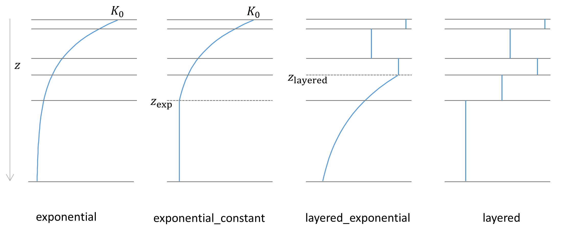

# [SBM](@id vert_sbm)

## Introduction
The SBM vertical concept has its roots in the Topog\_SBM model but has had considerable
changes over time. The main differences are:

- The unsaturated zone can be split-up in different layers
- The addition of evapotranspiration losses
- The addition of a capillary rise

The sections below describe the working of the SBM vertical concept in more detail.

## Precipitation
The division between solid and liquid precipitation (snowfall and rainfall, respectively) is
performed based on the air temperature. If the temperature is below a threshold temperature
(`tt`), precipitation will fall as snow. An interval parameter (`tti`) defines the range over
which precipitation is partly falling as snow, and partly as rain. Snowfall is added to the
snowpack, where it is subject to melting and refreezing (see the section on [snow and
glaciers](@ref snow)). The amount of rainfall is subject to [interception](@ref
interception), and ultimately becomes available for [evaporation](@ref evap) and/or [soil
processes](@ref soil).


*Division between snow and precipitation based on the threshold temperature*

```@setup
# Figure created using python: # hide
# https://gist.github.com/JoostBuitink/21dd32e71fd1360117fcd1c532c4fd9d#file-snowfall_fig-py # hide
```

## [Rainfall interception](@id interception)

Two different interception models are available: the analytical Gash model, and the modified
Rutter model. The simulation timestep defines which interception model is used, where daily
(or larger) timesteps use the Gash model, and timesteps smaller than daily use the modified
Rutter model.

### The analytical (Gash) model (Gash, 1979)
The analytical model of rainfall interception is based on Rutter’s numerical model. Simplifications 
allow the model to be applied on a daily basis, although a
storm-based approach will yield better results in situations with more than one storm per
day. The amount of water needed to completely saturate the canopy is defined as:

```math
P'=\frac{-\overline{R}S}{\overline{E}_{w}}ln\left[1-\frac{\overline{E}_{w}}{\overline{R}}(1-p-p_{t})^{-1}\right]
```

where ``\overline{R}`` is the average precipitation intensity on a saturated canopy and
``\overline{E}_{w}`` the average evaporation from the wet canopy and with the vegetation
parameters ``S``, ``p`` and ``p_t`` as defined previously. The model uses a series of
expressions to calculate the interception loss during different phases of a storm. An
analytical integration of the total evaporation and rainfall under saturated canopy
conditions is performed for each storm to determine average values of ``\overline{E}_{w}``
and ``\overline{R}``. The total evaporation from the canopy (the total interception loss) is
calculated as the sum of the components listed in the table below. Interception losses from
the stems are calculated for days with ``P\geq S_{t}/p_{t}``. ``p_t`` and ``S_t`` are small
and neglected.

Table: Formulation of the components of interception loss according to Gash:

| Components  | Interception loss |
|:----------- | ----------------- |
| For ``m`` small storms (``P_{g}<{P'}_{g}``)    | ``(1-p-p_{t})\sum_{j=1}^{m}P_{g,j}`` |
| Wetting up the canopy in ``n`` large storms (``P_{g}\geq{P'}_{g}``)     | ``n(1-p-p_{t}){P'}_{g}-nS`` |
| Evaporation from saturated canopy during rainfall | ``\overline{E}/\overline{R}\sum_{j=1}^{n}(P_{g,j}-{P'}_{g})``|
| Evaporation after rainfall ceases for ``n`` large storms | ``nS`` |
| Evaporation from trunks in ``q`` storms that fill the trunk storage | ``qS_{t}`` |
| Evaporation from  trunks in ``m+n-q`` storms that do not fill the trunk storage | ``p_{t}\sum_{j=1}^{m+n-q}P_{g,j}`` |

In applying the analytical model, saturated conditions are assumed to occur when the hourly
rainfall exceeds a certain threshold. Often a threshold of 0.5 mm/hr is used.
``\overline{R}`` is calculated for all hours when the rainfall exceeds the threshold to give
an estimate of the mean rainfall rate onto a saturated canopy.

Gash (1979) has shown that in a regression of interception loss on rainfall (on a storm
basis) the regression coefficient should equal to ``\overline{E}_w/\overline{R}``. Assuming
that neither ``\overline{E}_w`` nor ``\overline{R}`` vary considerably in time,
``\overline{E}_w`` can be estimated in this way from ``\overline{R}`` in the absence of
above-canopy climatic observations. Values derived in this way generally tend to be (much)
higher than those calculated with the penman-monteith equation.

### The modified rutter model
For sub daily timesteps the interception is calculated using a simplification of the Rutter
model. The simplified model is solved explicitly and does not take drainage from the canopy
into account. The amount of stemflow is taken as a fraction (`0.1 * canopygapfraction`) of
the precipitation. Throughfall equals to the amount of water that cannot be stored by the
canopy, plus the rainfall that is not captured by the canopy. Water can evaporate from the
canopy storage, taken as the minimum between potential evaporation and the current storage.
The "left-over" potential evaporation (if any) is returned as output.

```@docs
Wflow.rainfall_interception_modrut
```

### Interception parameters from LAI
The SBM concept can determine the interception parameters from leaf area index (LAI)
climatology. In order to switch this on you must define this cyclic parameter in the TOML
file, the parameter is read from `path_static`, as follows:

```toml
[input]
path_forcing = "data/forcing-moselle.nc"
path_static = "data/staticmaps-moselle.nc"

cyclic = ["vertical.leaf_area_index"]
```
Furthermore these additional parameters are required:
+ Specific leaf storage  (`sl` \[mm\])
+ Storage woody part of vegetation (`swood` \[mm\])
+ Extinction coefficient (`kext` \[-\])

Here it is assumed that `cmax` \[mm\] (leaves) (canopy storage capacity for the leaves only)
relates linearly with LAI (c.f. Van Dijk and Bruijnzeel 2001). This is done via the `sl`. `sl`
can be determined through a lookup table with land cover based on literature (Pitman 1989,
Lui 1998). Next the `cmax` (leaves) is determined using:

```math

    cmax(leaves)  = sl \, LAI
```
To get to total storage (`cmax`) the woody part of the vegetation also needs to be added. As
for `sl`, the storage of the woody part `swood` can also be related to land cover (lookup
table).

The canopy gap fraction is determined using the extinction coefficient `kext` (van Dijk and
Bruijnzeel 2001):

```math
    canopygapfraction = exp(-kext \, LAI)
```

The extinction coefficient `kext` can be related to land cover.

## [Evaporation](@id evap)

The wflow\_sbm model assumes the input to be potential reference evapotranspiration. A crop
coefficient (`kc`, set to 1 by default) is used to convert the potential evapotranspiration
rate of a reference crop fully covering the soil to the potential evapotranspiration rate of
vegetation (natural and agricultural) fully covering the soil. The crop coefficient `kc` of
wflow\_sbm is used for a surface completely covered by vegetation, and does not include the
effect of growing stages of vegetation and soil cover. These effects are handled separately
through the use of the canopy gap fraction. 

It is assumed that the potential evaporation rate of intercepted water by vegetation is
equal to the potential evapotranspiration rate of vegetation (fully covering the soil)
multiplied by the canopy fraction. The potential evapotranspiration rate left over after
interception is available for transpiration. For potential open water evaporation (river and
water bodies) the potential reference evapotranspiration rate is used (multipled by the
river fraction `riverfrac`, and open water fraction `waterfrac`). Also for potential soil
evaporation the potential reference evapotranspiration rate is used, multiplied by the
canopy gap fraction corrected by the sum of total water fraction (`riverfrac` and
`waterfrac`) and the fraction covered by a glacier (`glacierfrac`).

### Bare soil evaporation

If there is only one soil layer present in the wflow\_sbm model, the bare soil evaporation
is scaled according to the wetness of the soil layer. The fraction of bare soil is assumed
to be equal to the fraction not covered by the canopy (`canopygapfraction`) corrected by the
total water fraction. When the soil is fully saturated, evaporation is set to equal the
potential reference evaporation. When the soil is not fully saturated, actual evaporation
decreases linearly with decreasing soil moisture values, as indicated by the figure below.


*Evaporation reduction as function of available soil moisture*

```@setup
# Figure created using python: # hide
# https://gist.github.com/JoostBuitink/21dd32e71fd1360117fcd1c532c4fd9d#file-sbm_soil_figs-py # hide
```

When more soil layers are present, soil evaporation is only provided from the upper soil
layer, and soil evaporation is split in evaporation from the unsaturated store and
evaporation from the saturated store. Water is first evaporated from the unsaturated store.
The remaining potential soil evaporation can be used for evaporation from the saturated
store, but only when the water table is present in the upper soil layer. Both the
evaporation from the unsaturated store and the evaporation from the saturated store are
limited by the minimum of the remaining potential soil evaporation and the available water
in the unsaturated/saturated zone of the upper soil layer. Also for multiple soil layers,
the evaporation (both unsaturated and saturated) decreases linearly with decreasing water
availability.

### Transpiration

The fraction of wet roots is determined using a sigmoid fuction (see figure below). The
parameter `rootdistpar` defines the sharpness of the transition between fully wet and fully
dry roots. The returned wet roots fraction is multiplied by the potential evaporation (and
limited by the available water in saturated zone) to get the transpiration from the
saturated part of the soil. This is implemented using the following code (`i` refers to the
index of the vector that contains all active cells within the spatial model domain):

```julia
    # transpiration from saturated store
    wetroots = scurve(sbm.zi[i], rootingdepth, Float(1.0), sbm.rootdistpar[i])
    actevapsat = min(sbm.pottrans[i] * wetroots, satwaterdepth)
    satwaterdepth = satwaterdepth - actevapsat
    restpottrans = sbm.pottrans[i] - actevapsat
```


*Amount of wet roots and the effect of the rootdistpar parameter*

```@setup
# Figure created using python: # hide
# https://gist.github.com/JoostBuitink/21dd32e71fd1360117fcd1c532c4fd9d#file-sbm_soil_figs-py # hide
```

The remaining potential evaporation is used to extract water from the unsaturated store. The
maximum allowed extraction of the unsaturated zone is determined based on the fraction of
the unsaturated zone that is above the rooting depth, see conceptual figure below. This is
implemented using the following code:

```julia
    if ust # whole_ust_available = true
        availcap = ustorelayerdepth * 0.99
    else
        if usl > 0.0
            availcap = min(1.0, max(0.0, (rootingdepth - sumlayer) / usl))
        else
            availcap = 0.0
        end
    end
    maxextr = availcap * ustorelayerdepth
```


*Conceptual overview of how maxextr depends on rooting depth and water table depth*

```@setup
# Figure created using python: # hide
# https://gist.github.com/JoostBuitink/21dd32e71fd1360117fcd1c532c4fd9d#file-sbm_soil_figs-py # hide
```

!!! note
    When `whole_ust_available` is set to true in the TOML file, almost the complete
    unsaturated storage (99%) is available for transpiration, independent of the
    `rootingdepth`.

    ```toml
    [model]
    whole_ust_available = true
    ```

Next, a root water uptake reduction model is used to calculate a reduction coefficient as a
function of soil water pressure. This concept is based on the concept presented by Feddes et
al. (1978). This concept defines a reduction coefficient `a` as a function of soil water
pressure (`h`). Four different levels of `h` are defined: `h2`, `h3`, and `h4` are defined
as fixed values, and `h1` can be defined as input to the model (defaults to -10 cm). `h1`
represents the air entry pressure, `h2` represents field capacity, `h3` represents the point
of critical soil moisture content, and `h4` represents the wilting point. The current soil
water pressure is determined following the concept defined by Brooks and Corey (1964):

```math
    \frac{(\theta-\theta_r)}{(\theta_s-\theta_r)} =  \Bigg\lbrace{\left(\frac{h_b}{h}\right)^{\lambda}, h > h_b \atop 1 , h \leq h_b}
```

where ``h`` is the pressure head [cm], ``h_b`` is the air entry pressure head [cm], and
``\theta``, ``\theta_s``, ``\theta_r`` and ``\lambda`` as previously defined.

Whenever the current soil water pressure drops below `h4`, the root water uptake is set to
zero. The root water uptake is at ideal conditions whenever the soil water pressure is above
`h3`, with a linear transition between `h3` and `h4`. Note that in the original
transpiration reduction-curve of Feddes (1978) root water uptake above `h1` is set to zero
(oxygen deficit) and between `h1` and `h2` root water uptake is limited. The assumption that
very wet conditions do not affect root water uptake too much is probably generally
applicable to natural vegetation, however for crops this assumption is not valid. This could
be improved in the wflow code by applying the reduction to crops only.


*Root water uptake reduction coefficient as a function of soil water pressure*

```@setup
# Figure created using python: # hide
# https://gist.github.com/JoostBuitink/21dd32e71fd1360117fcd1c532c4fd9d#file-sbm_soil_figs-py # hide
```

## [Snow and glaciers](@id snow)

The snow and glacier model is described in [Snow and glaciers](@ref snow_and_glac). Both
options can be enabled by specifying the following in the TOML file:

```toml
[model]
snow = true
glacier = true
```

## [Soil processes](@id soil)

### The SBM soil water accounting scheme

A detailed description of the Topog\_SBM model has been given by Vertessy (1999). Briefly:
the soil is considered as a bucket with a certain depth (``z_{t}`` [mm]), divided into a
saturated store (``S`` [mm]) and an unsaturated store (``U`` [mm]). The top of the ``S``
store forms a pseudo-water table at depth ``z_{i}`` [mm] such that the value of ``S`` at any
time is given by:

```math
    S=(z_{t}-z_{i})(\theta_{s}-\theta_{r})
```

where ``\theta_{s}`` [-] and ``\theta_{r}`` [-] are the saturated and residual soil water
contents, respectively.

The unsaturated store ``U`` is subdivided into storage (``U_{s}`` [mm]) and deficit
(``U_{d}`` [mm]):

```math
    U_{d}=(\theta_{s}-\theta_{r})z_{i}-U\\
    U_{s}=U-U_{d}
```

The saturation deficit (``S_{d}`` [mm]) for the soil profile as a whole is defined as:

```math
    S_{d}=(\theta_{s}-\theta_{r})z_{t}-S
```

All infiltrating water that enters the ``U`` store first. The unsaturated layer can be
split-up in different layers, by providing the thickness [mm] of the layers in the TOML
file. The following example specifies three layers (from top to bottom) of 100, 300 and 800
mm:

```toml
[model]
thicknesslayers = [100, 300, 800]
```

The code checks for each grid cell the specified layers against the `soilthickness` [mm],
and adds or removes (partly) layer(s) based on the `soilthickness`.

Assuming a unit head gradient, the transfer of water (``st`` [mm t``^{-1}``]) from a ``U``
[mm] store layer is controlled by the saturated hydraulic conductivity ``K_{sat}`` [mm
t``^{-1}``] at depth ``z`` \[mm\] (bottom layer) or ``z_{i}`` [mm], the effective saturation
degree of the layer, and a Brooks-Corey power coefficient (parameter ``c``) based on the
pore size distribution index ``\lambda`` (Brooks and Corey, 1964):

```math
    st=K_{\mathit{sat}}\left(\frac{\theta-\theta_{r}}{\theta_{s}-\theta_{r}}\right)^{c}\\~\\
    c=\frac{2+3\lambda}{\lambda}
```

When the unsaturated layer is not split-up into different layers, it is possible to use the
original Topog\_SBM vertical transfer formulation, by specifying in the TOML file:

```toml
[model]
transfermethod = true
```

The transfer of water from the ``U`` [mm] store to the ``S`` [mm] store (``st`` [mm
t``^{-1}``]) is in that case controlled by the saturated hydraulic conductivity ``K_{sat}``
[mm t``^{-1}``] at depth ``z_{i}`` [mm] and the ratio between ``U`` [mm] and ``S_{d}``
[mm]:

```math
    st=K_{\mathit{sat}}\frac{U_{s}}{S_{d}}
```

Four different saturated hydraulic conductivity depth profiles (`ksat_profile`) are
available and a `ksat_profile` can be specified in the TOML file as follows:

```toml
[input.vertical]
ksat_profile = "exponential_constant" # optional, one of ("exponential", "exponential_constant", "layered", "layered_exponential"), default is "exponential"
```

Soil measurements are often available for about the upper 1.5-2 m of the soil column to
estimate the saturated hydraulic conductivity, while these measurements are often lacking
for soil depths beyond 1.5-2 m. These different profiles allow to extent the saturated
hydraulic conductivity profile based on measurements (either an exponential fit or hydraulic
conductivity value per soil layer) with an exponential or constant profile. By default, with
`ksat_profile` "exponential", the saturated hydraulic conductivity (``K_{sat}`` [mm
t``^{-1}``]) declines with soil depth (``z`` [mm]) in the model according to:

```math
    K_{sat}=K_{0}e^{(-fz)},
```
where ``K_{0}`` [mm t``^{-1}``] is the saturated hydraulic conductivity at the soil surface
and ``f`` is a scaling parameter [mm``^{-1}``].

The plot below shows the relation between soil depth ``z`` and saturated hydraulic
conductivity ``K_{sat}`` for different values of ``f``.

```@setup plot
    using Printf
    using CairoMakie
```

```@example plot
    let                                                                                     # hide
        fig = Figure(resolution = (800, 400))                                               # hide
        ax = Axis(fig[1, 1], xlabel = "Kₛₐₜ [mm/day]", ylabel = "-z [mm]")                  # hide

        z = 0:5.0:1000                                                                      # hide
        ksat = 100.0                                                                        # hide
        f = 0.6 ./ collect(50:150.0:800)                                                    # hide

        for fi in f                                                                         # hide
            lines!(ax, ksat .* exp.(-fi .* z), -z, label = @sprintf("f = %.2e", fi))        # hide
        end                                                                                 # hide

        Legend(fig[1, 2], ax, "f")                                                          # hide
        fig                                                                                 # hide
    end                                                                                     # hide
```

With `ksat_profile` "exponential\_constant", ``K_{sat}`` declines exponentially with soil
depth ``z`` until ``z_\mathrm{exp}`` [mm] below the soil surface, and stays constant at and
beyond soil depth ``z_\mathrm{exp}``:

```math
    K_{sat} = \begin{cases}
    K_{0}e^{(-fz)} & \text{if $z < z_\mathrm{exp}$}\\
    K_{0}e^{(-fz_\mathrm{exp})} & \text{if $z \ge z_\mathrm{exp}$}.
    \end{cases}
```

It is also possible to provide a ``K_{sat}`` value per soil layer by specifying
`ksat_profile` "layered", these ``K_{sat}`` values are used directly to compute the vertical
transfer of water between soil layers and to the saturated store ``S``. Finally, with the
`ksat_profile` "layered\_exponential" a ``K_{sat}`` value per soil layer is used until depth
``z_\mathrm{layered}`` below the soil surface, and beyond ``z_\mathrm{layered}`` an
exponential decline of ``K_{sat}`` (of the soil layer with bottom ``z_\mathrm{layered}``)
controlled by ``f`` occurs. The different available `ksat_profle` options are schematized in
the figure below where the blue line represents the ``K_{sat}`` value.



*Overview of available `ksat_profile` options, for a soil column with five layers*

### Infiltration

The water available for infiltration is taken as the rainfall including meltwater.
Infiltration is determined separately for the compacted and non-compacted areas, as these
have different infiltration capacities. Naturally, only the water that can be stored in the
soil can infiltrate. If not all water can infiltrate, this is added as excess water to the
runoff routing scheme.

The infiltrating
water is split in two parts, the part that falls on compacted areas and the part that falls
on non-compacted areas. The maximum amount of water that can infiltrate in these areas is
calculated by taking the minimum of the maximum infiltration rate (`infiltcapsoil` [mm
t``^{-1}``] for non-compacted areas and `infiltcappath` [mm t``^{-1}``] for compacted areas)
and the amount of water available for infiltration `avail_forinfilt` [mm t``^{-1}``]. The
water that can actually infiltrate `infiltsoilpath` [mm t``^{-1}``] is calculated by taking
the minimum of the total maximum infiltration rate (compacted and non-compacted areas) and
the remaining storage capacity.

Infiltration excess occurs when the infiltration capacity is smaller then the throughfall
and stemflow rate. This amount of water (`infiltexcess` [mm t``^{-1}``]) becomes overland
flow (infiltration excess overland flow). Saturation excess occurs when the (upper) soil
becomes saturated and water cannot infiltrate anymore. This amount of water `excesswater`
[mm t``^{-1}``] becomes overland flow (saturation excess overland flow).

#### Infiltration in frozen soils

If snow processes are modelled, the infiltration capacity is reduced when the soil is frozen
(or near freezing point). A infiltration correction factor is defined as a S-curve with the
shape as defined below. A parameter (`cf_soil`) defines the base factor of infiltration when
the soil is frozen. The soil temperature is calculated based on the soil temperature on the
previous timestep, and the temperature difference between air and soil temperature weighted
with a factor (`w_soil`, which defaults to 0.1125).

The near surface soil temperature is modelled using a simple equation (Wigmosta et al.,
2009):

```math
T_s^{t} = T_s^{t-1} + w  (T_a - T_s^{t-1})
```
where ``T_s^{t}`` [``\degree``C] is the near-surface soil temperature at time ``t``, ``T_a``
[``\degree``C] is air temperature and ``w`` [-] is a weighting coefficient determined
through calibration (default is 0.1125 for daily timesteps).

A reduction factor (`cf_soil` [-], default is 0.038) is applied to the maximum infiltration
rate (`infiltcapsoil` and `infiltcappath`), when the following model settings are specified
in the TOML file:

```toml
[model]
soilinfreduction = true
snow = true
```

If `soilinfreduction` is set to `false`, water is allowed to infiltrate the soil, even if
the soil is frozen.

A S-curve (see plot below) is used to make a smooth transition (a c-factor (``c``) of 8.0 is
used):

```math
    b = \frac{1.0}{(1.0 - cf\_soil)}\\~\\
    soilinfredu = \frac{1.0}{b + exp(-c (T_s - a))} + cf\_soil\\~\\
    a = 0.0\\
    c = 8.0
```


*Infiltration correction factor as a function of soil temperature*

```@setup
# Figure created using python: # hide
# https://gist.github.com/JoostBuitink/21dd32e71fd1360117fcd1c532c4fd9d#file-sbm_soil_figs-py # hide
```


### Capillary rise

The actual capillary rise `actcapflux` [mm t``^{-1}``] is determined using the following
approach: first the saturated hydraulic conductivity `ksat` [mm t``^{-1}``] is determined at
the water table ``z_{i}``; next a potential capillary rise `maxcapflux` [mm t``^{-1}``] is
determined from the minimum of `ksat`, actual transpiration `actevapustore` [mm t``^{-1}``]
taken from the ``U`` store, available water in the ``S`` store (`satwaterdepth` [mm]) and
the deficit of the ``U`` store (`ustorecapacity` [mm]), as shown by the following code
block:

```julia
    maxcapflux = max(0.0, min(ksat, actevapustore, ustorecapacity, satwaterdepth))
```

Then the potential rise `maxcapflux` is scaled using the water table depth `zi`, a maximum
water depth `cap_hmax` [mm] beyond which capillary rise ceases and a coefficient `cap_n`
[-], as follows in the code block below (`i` refers to the index of the vector that contains
all active cells within the spatial model domain):

```julia
    if sbm.zi[i] > rootingdepth
        capflux =
            maxcapflux * pow(
                1.0 - min(sbm.zi[i], sbm.cap_hmax[i]) / (sbm.cap_hmax[i]),
                sbm.cap_n[i],
            )
    else
        capflux = 0.0
    end
```

If the roots reach the water table (`rootingdepth` ``\ge`` `sbm.zi`), `capflux` is set to
zero.

Finally, the capillary rise `capflux` is limited by the unsaturated store deficit (one or
multiple layers), calculated as follows in the code block below (`i` refers to the index of
the vector that contains all active cells within the spatial model domain, and `k` refers to
the layer position):

```julia
    usl[k] * (sbm.θₛ[i] - sbm.θᵣ[i]) - usld[k]
```

where `usl` [mm] is the unsaturated layer thickness, `usld` is the `ustorelayerdepth` \[mm\]
(amount of water in the unsaturated layer), and ``\theta_{s}`` and ``\theta_{r}`` as
previously defined.

The calculation of the actual capillary rise `actcapflux` is as follows in the code block
below (`i` refers to the index of the vector that contains all active cells within the
spatial model domain, and `k` refers to the layer position):

```julia
    actcapflux = 0.0
    netcapflux = capflux
    for k = n_usl:-1:1
        toadd =
            min(netcapflux, max(usl[k] * (sbm.θₛ[i] - sbm.θᵣ[i]) - usld[k], 0.0))
        usld = setindex(usld, usld[k] + toadd, k)
        netcapflux = netcapflux - toadd
        actcapflux = actcapflux + toadd
    end
```

In case of multiple unsaturated layers (`n_usl` ``>`` 1), the calculation of the actual
capillary rise starts at the lowest unsaturated layer while keeping track of the remaining
capillary rise `netcapflux` [mm t``^{-1}``].

### Leakage

If the `maxleakage` (mm/day) input model parameter is set > 0, water is lost from the
saturated zone and runs out of the model.

## Open water

Part of the water available for infiltration is diverted to the open water, based on the
fractions of river and lakes of each grid cell. The amount of evaporation from open water is
assumed to be equal to potential evaporation (if sufficient water is available).

## References
+ Brooks, R. H., and Corey, A. T., 1964, Hydraulic properties of porous media, Hydrology
  Papers 3, Colorado State University, Fort Collins, 27 p.
+ Feddes, R.A., Kowalik, P.J. and Zaradny, H., 1978, Simulation of field water use and crop
  yield, Pudoc, Wageningen, Simulation Monographs.
+ Gash, J. H. C., 1979, An analytical model of rainfall interception by forests, Q. J. Roy.
  Meteor. Soc., 105, 43–55, doi:1026 10.1002/qj.497105443041027.
+ Liu, S., 1998, Estimation of rainfall storage capacity in the canopies of cypress wetlands
  and slash pine uplands in North-Central Florida, J. Hydr., 207, 32–41, doi:
  10.1016/S0022-1694(98)00115-2.
+ Pitman, J., 1989, Rainfall interception by bracken in open habitats—relations between leaf
  area, canopy storage and drainage rate, J. Hydr. 105, 317–334, doi:
  10.1016/0022-1694(89)90111-X.
+ Van Dijk, A. I. J. M., and Bruijnzeel, L. A., 2001, Modelling rainfall interception by
  vegetation of variable density using an adapted analytical model, Part 2, Model validation
  for a tropical upland mixed cropping system, J. Hydr., 247, 239–262.
+ Vertessy, R., and Elsenbeer, H., 1999, Distributed modeling of storm flow generation in an
  amazonian rain forest catchment: effects of model parameterization, Water Resour. Res.,
  35, 2173–2187. doi: 10.1029/1999WR9000511257.
+ Wigmosta, M. S., Lane, L. J., Tagestad, J. D., and Coleman A. M., 2009, Hydrologic and
  erosion models to assess land use and management practices affecting soil erosion, J.
  Hydrol. Eng., 14, 27-41.
