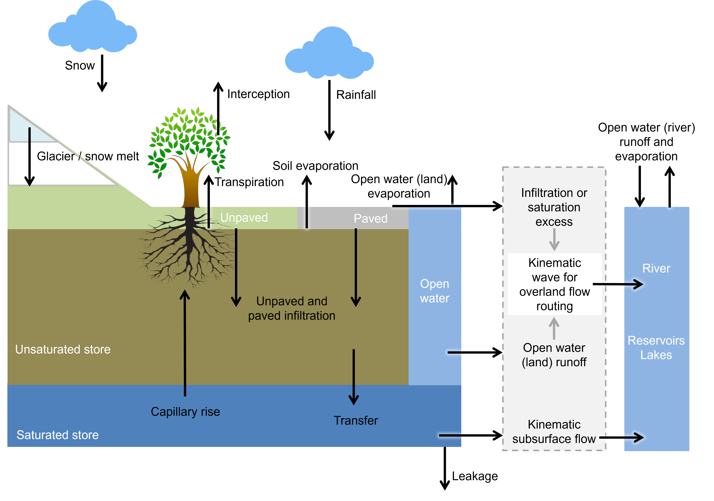

# wflow\_sbm (new description)

## Introduction

The soil part of wflow\_sbm model concept is largely based on the Topog\_sbm mode, but 
has had considerable changes over time. The main changes in wflow\_sbm are:

- The unsaturated zone can be split up in different layers
- The addition of evapotranspiration losses
- The addition of capillary rise
- Wflow\_sbm routes water over a D8 network instead of an element network based on contour lines and trajectories

For the lateral components of this wflow\_sbm model water is routed over a D8 network, and
the kinematic wave approach is used for river, overland and lateral subsurface flow. This is
described in more detail in the section [Kinematic wave].

An overview of the different processes and fluxes in the wflow_sbm model:



## Precipitation 
The division between solid and liquid precipitation (snowfall and rainfall, respectively) is 
performed based on the air temperature. If the temperature is below a threshold temperature 
(`tt`), precipitation will fall as snow. A interval parameter (`tti`) defines the range 
over which precipitation is partly falling as snow, and partly as rain. Snowfall is added
to the snowpack, where it is subject to melting and refreezing (see the section on 
[snow and glaciers](@ref snow)). The amount of rainfall is subject to 
[interception](@ref interception), and ultimately becomes available for [evaporation](@ref evap) 
and/or [soil processes](@ref soil).

 

## [Rainfall interception](@id interception)

Two different interception models are available: the analytical Gash model, and the modified
Rutter model. The simulation timestep defines which interception model is used, where daily
(or larger) timesteps use the Gash model, and timesteps smaller than daily use the modified 
Rutter model.

### The analytical Gash model (Gash, 1979)
The Gash model generally assumes that there is one rainfall event per day. It calculates the
amount of water required to fully saturate the canopy. The amount of stemflow is taken as 
a fraction (`0.1 * canopygapfraction`) of the precipitation. Throughfall is the precipitation 
that is not intercepted by the leaves and stems. If the interception is larger than the 
potential evaporation, the amount above potential evaporation is added to the throughfall, 
as the concept is based on a daily timestep (assuming that the canopy storage is emptied at 
the end of the timestep). 

### The modified Rutter model (Rutter et al., 1971)

The amount of stemflow is taken as a fraction (`0.1 * canopygapfraction`) of the 
precipitation. Throughfall equals to the amount of water that cannot be stored by the 
canopy, plus the rainfall that is not captured by the canopy. There is no flow from water
on the leaves to the ground, when the canopy storage is below the maximum canopy storage 
(`cmax`). Water can evaporate from the canopy storage, taken as the minimum between potential 
evaporation and the current storage. The "left-over" potential evaporation (if any) is 
returned as output.

## [Evaporation](@id evap)

The wflow\_sbm model assumes the input to be potential evaporation. A multiplication factor (`et_reftopot`, set to 1 by default) is present to correct the input evaporation if required. 

The potential evaporation left over after interception and open water evaporation (rivers and water bodies) is split in potential soil evaporation and potential transpiration based on the canopy gap fraction (assumed to be identical to the amount of bare soil). 

## [Snow and glaciers](@id snow)

The snow and glacier model is described in [Snow and glaciers](@ref snow_and_glac). Both
options can be enabled by specifying the following in the TOML file:

```toml
[model]
snow = true
glacier = true
```

## [Soil processes](@id soil)

### Bare soil evaporation

If there is only one soil layer present in the wflow\_sbm model, the bare soil evaporation is scaled according to the wetness of the soil layer. The fraction of bare soil is assumed to be equal to the fraction not covered by the canopy (`conapygapfraction`). When the soil is fully saturated, evaporation is set to equal the potential evaporation. When the soil is not fully saturated, actual evaporation decrease linearly with decreasing soil moisture values, as indicated by the figure below.

 

When more soil layers are present, soil evaporation is only provided from the upper soil layer, and soil evaporation is split in evaporation from the unsaturated store and evaporation from the saturated store. Water is first evaporated water from the unsaturated store. The remaining potential soil evaporation can be used for evaporation from the saturated store, but only when the water table is present in the upper soil layer. 

### Transpiration

The fraction of wet roots is determined using a sigmoid fuction (see figure below). The parameter `rootdistpar` defines the sharpness of the transition between fully wet and fully dry roots. The returned wetroots fraction is multiplied by the potential evaporation (and limited by the available water in saturated zone) to get the transpiration from the saturated part of the soil.

 

The remaining potential evaporation is used to extract water from the unsaturated store. The maximum allowed extration of the unsaturated zone is determined based on the fraction of the unsaturated zone that is above the rooting depth, see conceptual figure below. 

 

!!! note
    When `whole_ust_available` is set to true in the TOML file, almost the complete unsaturated storage (99%) is available for transpiration, independent of the `rootingdepth`.

    ```toml
    [model]
    whole_ust_available = true
    ```

Next, a root water uptake reduction model is used to calculate a reduction coefficient as a function of soil water pressure. This concept is based on the concept presented by Feddes et al. (1978). This concept defines a reduction coefficient `a` as a function of soil water pressure (`h`). Four different levels of `h` are defined: `h2`, `h3`, and `h4` are defined as fixed values, and `h1` can be defined as input to the model (defaults to -10 cm). `h1` represents the air entry pressure, `h2` represents field capacity, `h3` represents the point of critical soil moisture content, and `h4` represents the wilting point. The current soil water pressure is determined following the concept defined by Brooks and Corey (1964). 

Whenever the current soil water pressure drops below `h4`, the root water uptake is set to zero. The root water uptake is at ideal conditions whenever the soil water pressure is above `h3`, with a linear transition between `h3` and `h4`. In the original concept, root water uptake is set be reduced when soil water pressures are above field capacity (`h2`). This is not inplemented in wlow\_sbm, as the assumption from the original concept does not apply to crops. 

 

### Infiltration

The water available for infiltration is taken as the rainfall including meltwater. Infiltration is determined seperately for the compacted and non compacted areas, as these have different infitration capacities. Naturally, only the water that can be stored in the soil can infiltrate. If not all water can infiltrate, this is added as excess water to the runoff routing scheme. 

If snow processes are modelled, the infiltration capacity is reduced when the soil is frozen (or near freezing point). A infiltration correction factor is defined as a S-curve with the shape as defined below. A parameter (`cf_soil`) defines the base factor of infiltration when the soil is frozen. The soil temperature is calculated based on the soil temperature on the previous timestep, and the temperature difference between air and soil temperature weighted with a factor (`w\_soil`, which defaults to 0.1125).

 

!!! note
    The following options need to be enabled in the TOML file to allow for this correction factor. If `soilinfreduction` is set to `false`, water is allowed to infiltrate the soil, even if the soil is frozen.

    ```toml 
    [model]
    snow = true
    soilinfreduction = true
    ```


### Capillary rise

The actual capillary rise `actcapflux` [mm t``^{-1}``] is determined using the following
approach: first the saturated hydraulic conductivty `ksat` [mm t``^{-1}``] is determined at
the water table ``z_{i}``; next a potential capillary rise `maxcapflux` [mm t``^{-1}``] is
determined from the minimum of `ksat`, actual transpiration `actevapustore` [mm t``^{-1}``]
taken from the ``U`` store, available water in the ``S`` store (`satwaterdepth` [mm]) and
the deficit of the ``U`` store (`ustorecapacity` [mm]), as shown by the following code
block:

```julia
    maxcapflux = max(0.0, min(ksat, actevapustore, ustorecapacity, satwaterdepth))
```

Then the potential rise `maxcapflux` is scaled using the water table depth `zi` and a
maximum water depth `cap_hmax` [mm] beyond which capillary rise ceases as follows in the
code block below (`i` refers to the index of the vector that contains all active cells
within the spatial model domain):

```julia
    if sbm.zi[i] > rootingdepth
        capflux =
            maxcapflux *
            pow(1.0 - min(sbm.zi[i], sbm.cap_hmax[i]) / (sbm.cap_hmax[i]), 2.0)
    else
        capflux = 0.0
    end
```

If the roots reach the water table (`rootingdepth` ``\ge`` `sbm.zi`), `capflux` is set to
zero and thus setting the capillary rise `capflux` to zero.

Finally, the capillary rise `capflux` is limited by the unsaturated store deficit (one or
multiple layers), calculated as follows in the code block below (`i` refers to the index of
the vector that contains all active cells within the spatial model domain, and `k` refers to
the layer position):

```julia
    usl[k] * (sbm.θₛ[i] - sbm.θᵣ[i]) - usld[k]
```

where `usl` [mm] is the unsaturated layer thickness, `usld` is the `ustorelayerdepth` \[mm\]
(amount of water in the unsaturated layer), and ``\theta_{s}`` and ``\theta_{r}`` as
previously defined.

The calculation of the actual capillary rise `actcapflux` is as follows in the code block
below (`i` refers to the index of the vector that contains all active cells within the
spatial model domain, and `k` refers to the layer position):

```julia
    actcapflux = 0.0
    netcapflux = capflux
    for k = n_usl:-1:1
        toadd =
            min(netcapflux, max(usl[k] * (sbm.θₛ[i] - sbm.θᵣ[i]) - usld[k], 0.0))
        usld = setindex(usld, usld[k] + toadd, k)
        netcapflux = netcapflux - toadd
        actcapflux = actcapflux + toadd
    end
```

In case of multiple unsaturated layers (`n_usl` ``>`` 1), the calculation of the actual
capillary rise starts at the lowest unsaturated layer while keeping track of the remaining
capillary rise `netcapflux` [mm t``^{-1}``].

### Leakage

!!! warning
    ToDo 
    
    ```julia
    deepksat = sbm.kv₀[i] * exp(-sbm.f[i] * sbm.soilthickness[i])
    deeptransfer = min(satwaterdepth, deepksat)
    ```
If the `maxleakage` (mm/day) input model parameter is set > 0, water is lost from the saturated zone and runs out of the model.

## Open water

Part of the water available for infiltration is diverted to the open water, based on the fractions of river and lakes of each grid cell. The amount of evaporation from open water is taken assumed to be equal to potential evaporation (if sufficient water is available).