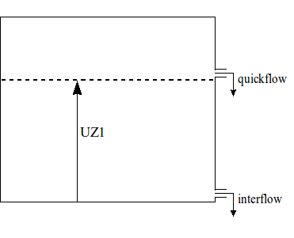

# HBV vertical concept

## Snow
The snow model is described in [Snow modelling](@ref).

## Glaciers
Glacier processes are described in [Glacier modelling](@ref). Glacier modelling is enabled
by specifying the following in the TOML file:

```toml
[model]
glacier = true
```
## Potential Evaporation
The `cevpf` model parameter is used to adjust the potential evaporation based on land use.
In the original HBV version cevpfo is used, a factor for forest land use only.

## Interception
For interception storage a single `icf` parameter is used according to the land use. In this
implementation interception evaporation is subtracted to ensure total evaporation does not
exceed potential evaporation. From this storage evaporation equal to the potential
evaporation rate will occur as long as water is available, even if it is stored as snow. All
water enters this store first, there is no concept of free throughfall (e.g. through gaps in
the canopy). In the model a running water budget is kept of the interception store:

+ The available storage (`icf`- actual storage) is filled with the water coming from the
  snow routine (``Q_{in}``)
+ Any surplus water now becomes the new ``Q_{in}``
+ Interception evaporation is determined as the minimum of the current interception storage
  and the potential evaporation

## The soil routine
The incoming water from the snow and interception routines, ``Q_{in}``, is available for
infiltration in the soil routine. The soil layer has a limited capacity, `fc`, to hold soil
water, which means if `fc` is exceeded the abundant water cannot infiltrate and,
consequently, becomes directly available for runoff.

```math
    Q_{dr}=max((SM+Q_{in}−fc);0.0)
```

where ``Q_{dr}`` is the abundant soil water (also referred to as direct runoff) and ``SM``
is the soil moisture content. Consequently, the net amount of water that infiltrates into
the soil, ``I_{net}``, equals:

```math
I_{net} = Q_{in} − Q_{dr}
```

Part of the infiltrating water, ``I_{net}``, will runoff through the soil layer (seepage).
This runoff volume, ``SP``, is related to the soil moisture content, ``SM``, through the
following power relation:

```math
SP = \left(\frac{SM}{fc}\right)^\beta I_{net}
```

where ``\beta`` is an empirically based parameter. Application of this equation implies that
the amount of seepage water increases with increasing soil moisture content. The fraction of
the infiltrating water which does not runoff, ``I_{net}−SP``, is added to the available
amount of soil moisture, ``SM``. The ``\beta`` parameter affects the amount of supply to the
soil moisture reservoir that is transferred to the quick response reservoir. Values of
``\beta`` vary generally between 1 and 3. Larger values of ``\beta`` reduce runoff and
indicate a higher absorption capacity of the soil.

 

*Schematic view of the soil moisture routine*

A percentage of the soil moisture will evaporate. This percentage is related to the
potential evaporation and the available amount of soil moisture:

```math
    E_a = \frac{SM}{T_m} E_p \, ; \, SM<T_m \\~\\
    E_a = E_p \, ; \, SM \geq T_m
```

where ``E_a`` is the actual evaporation, ``E_p`` is the potential evaporation and ``T_m``
(``\leq fc``) is a user defined threshold, above which the actual evaporation equals the
potential evaporation. ``T_m`` is defined as ``LP * fc`` in which ``LP`` is a soil dependent
evaporation factor (``LP\leq 1``).

In the original model (Bergström, 1992), a correction to ``E_a`` is applied in case of
interception. If ``E_a`` from the soil moisture storage plus ``E_i`` exceeds ``ET_p−E_i``
(``E_i`` = interception evaporation) then the exceeding part is multiplied by a factor
(``1-e_{red}``), where the parameter ``e_{red}`` varies between 0 and 1. This correction is
not present in the wflow\_hbv model.

## The runoff response routine

The volume of water which becomes available for runoff, ``S_{dr}+SP``, is transferred to the
runoff response routine. In this routine the runoff delay is simulated through the use of a
number of linear reservoirs.

Two linear reservoirs are defined to simulate the different runoff processes: the upper zone
(generating quick runoff and interflow) and the lower zone (generating slow runoff). The
available runoff water from the soil routine (i.e. direct runoff, ``S_{dr}``, and seepage,
``SP``) in principle ends up in the lower zone, unless the percolation threshold, ``PERC``,
is exceeded, in which case the redundant water ends up in the upper zone:

```math
\Delta V_{LZ}=min(PERC;(S_{dr}+SP)) \\~\\
\Delta V_{UZ}=max(0.0;(S_{dr}+SP−PERC))
```

where ``V_{UZ}`` is the content of the upper zone, ``V_{LZ}`` is the content of the lower
zone.

Capillary flow from the upper zone to the soil moisture reservoir is modeled according to: 

```math
Q_{cf}=cflux \; (fc−SM)/fc
```

where ``cflux`` is the maximum capillary flux [mm day``^{-1}``].

The upper zone generates quick runoff (Q_q) using:
```math
Qq=K \, UZ^{(1+\alpha)}
```
where ``K`` is the upper zone recession coefficient, and ``\alpha`` determines the amount of
non-linearity. Within HBV-96, the value of ``K`` is determined from three other parameters:
``\alpha``, ``KHQ``, and ``HQ`` [mm day``^{-1}``]. The value of ``HQ`` represents an outflow
rate of the upper zone for which the recession rate is equal to ``KHQ``. If we define
``UZ_{HQ}`` to be the content of the upper zone at outflow rate ``HQ`` we can write the
following equation:

```math
    HQ=K \, UZ^{(1+\alpha)} \; HQ = KHQ \; UZ_{HQ}
```

If we eliminate ``UZ_{HQ}`` we obtain:

```math
    HQ = K \left(\frac{HQ}{KHQ}\right)^{(1+\alpha)}
```

Rewriting for ``K`` results in:
```math
    K = KQH^{(1−\alpha)} HQ^{−\alpha}
```

The lower zone is a linear reservoir, which means the rate of slow runoff, ``Q_{LZ}``, which
leaves this zone during one time step equals: 

```math
Q_{LZ} = K_{LZ} \, V_{LZ}
```

where ``K_{LZ}`` is the reservoir constant.

The upper zone is also a linear reservoir, but it is slightly more complicated than the
lower zone because it is divided into two zones: a lower part in which interflow is
generated and an upper part in which quick flow is generated.

 

*Schematic view of the upper zone*

If the total water content of the upper zone, ``V_{UZ}`` is lower than a threshold ``UZ1``,
the upper zone only generates interflow. On the other hand, if ``V_{UZ}`` exceeds ``UZ1``,
part of the upper zone water will runoff as quick flow:

```math
    Q_i = K_i min(UZ1;V_{uz})\\
    Q_q = K_q max((V_{UZ}−UZ1);0.0)
```

Where ``Q_i`` is the amount of generated interflow in one time step, ``Q_q`` is the amount
of generated quick flow in one time step and ``K_i`` and ``K_q`` are reservoir constants for
interflow and quick flow respectively.

The total runoff rate, ``Q``, is equal to the sum of the three different runoff components:

```math
    Q = Q_{LZ}+Q_i+Q_q
```

The runoff behavior in the runoff response routine is controlled by two threshold values
``P_m`` and ``UZ1`` in combination with three reservoir parameters, ``K_{LZ}``, ``K_i`` and
``K_q``.

In order to represent the differences in delay times between the three runoff components,
the reservoir constants have to meet the following requirement:
```math
    K_{LZ}<K_i<K_q
```

## References
 + Bergström, S., 1992, The HBV model–its structure and applications, SMHI Reports RH 4,
   Norrköping.
